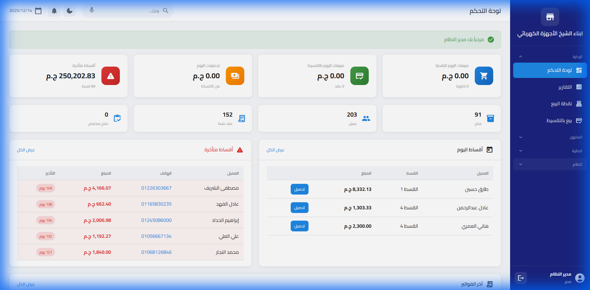
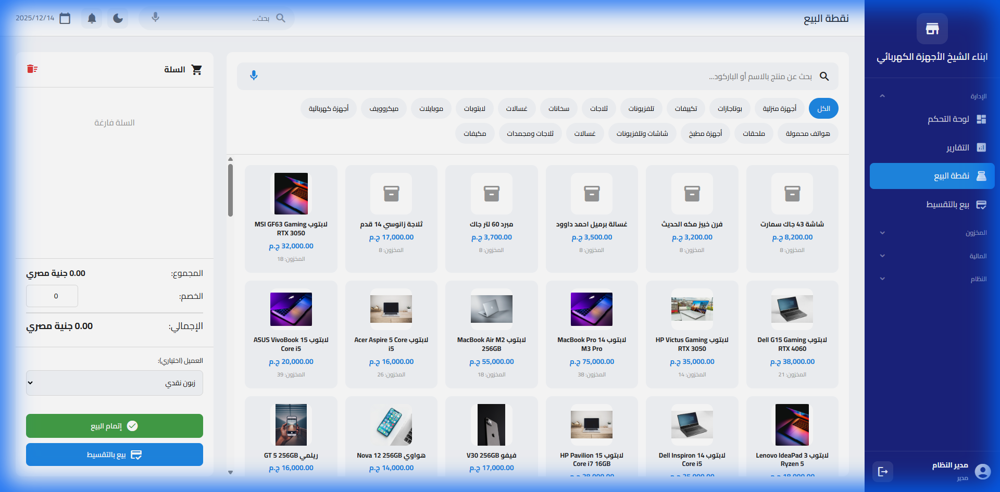
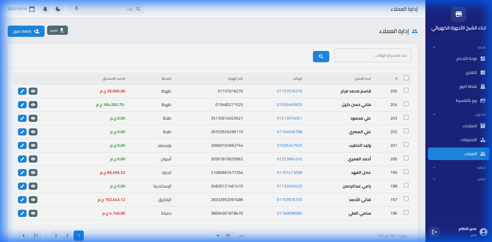
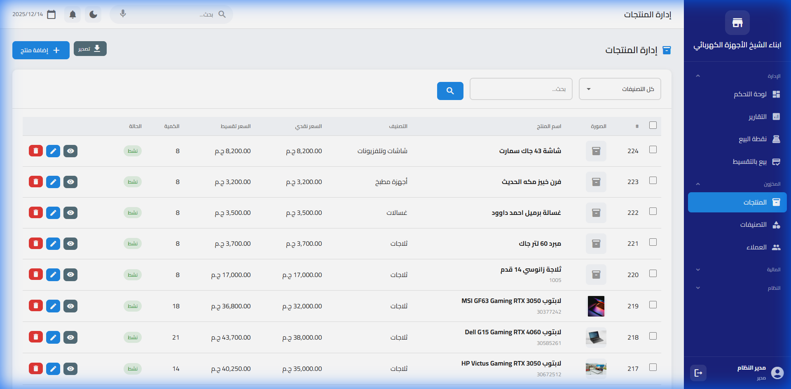
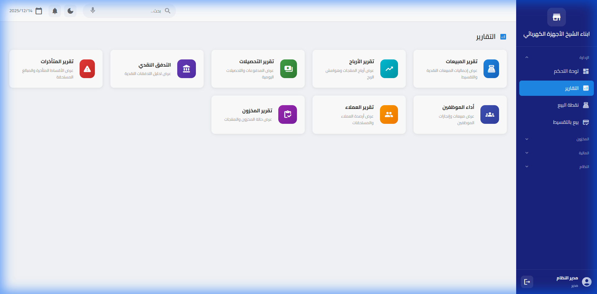
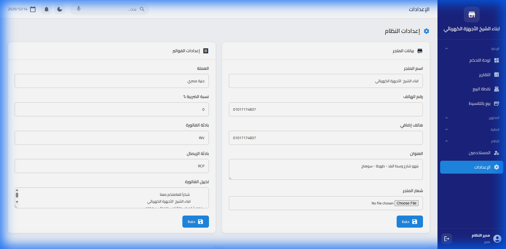

<div dir="rtl">

# نظام تقسيط - NizamTaqsit

<div align="center">



**نظام متكامل لإدارة التقسيط والمبيعات**

[](https://php.net)
[](https://sqlite.org)
[](https://docker.com)
[](LICENSE)

</div>

---

## 📋 المحتويات

- [نظرة عامة](#-نظرة-عامة)
- [المميزات](#-المميزات)
- [لقطات الشاشة](#-لقطات-الشاشة)
- [المتطلبات](#-المتطلبات)
- [التثبيت](#-التثبيت)
- [الاستخدام](#-الاستخدام)
- [Docker](#-docker)

---

## 🎯 نظرة عامة

نظام تقسيط هو تطبيق ويب متكامل لإدارة عمليات البيع بالتقسيط. يتيح للمحلات التجارية إدارة العملاء، المنتجات، خطط التقسيط، والمدفوعات بكفاءة عالية.

---

## ✨ المميزات

| الميزة | الوصف |
|--------|-------|
| 🏠 **لوحة تحكم** | عرض شامل للإحصائيات والتنبيهات |
| 🛒 **نقطة البيع** | واجهة سهلة للمبيعات السريعة |
| 👥 **إدارة العملاء** | تسجيل ومتابعة بيانات العملاء |
| 📦 **إدارة المنتجات** | إضافة وتعديل المنتجات والفئات |
| 💳 **خطط التقسيط** | إنشاء ومتابعة خطط السداد |
| 💰 **إدارة المدفوعات** | تسجيل الأقساط والمتأخرات |
| 📊 **التقارير** | تقارير تفصيلية للمبيعات والتحصيل |
| ⚙️ **الإعدادات** | تخصيص النظام والمظهر |
| 🎨 **ثيمات مخصصة** | تخصيص المظهر لكل موظف |
| 🔐 **الصلاحيات** | نظام أدوار وصلاحيات متكامل |

---

## 📸 لقطات الشاشة

### 🏠 لوحة التحكم (Dashboard)
تعرض ملخص شامل للنظام يتضمن:
- إجمالي المبيعات والتحصيلات
- عدد العملاء والأقساط المتأخرة
- رسوم بيانية للأداء
- آخر العمليات والتنبيهات


---

### 🛒 نقطة البيع (POS)
واجهة البيع السريع:
- عرض المنتجات حسب الفئات
- البحث السريع في المنتجات
- سلة المشتريات
- خيارات الدفع (نقدي/تقسيط)



---

### 👥 إدارة العملاء
إدارة شاملة للعملاء:
- إضافة عملاء جدد
- عرض بيانات العميل
- سجل المشتريات والأقساط
- البحث والفلترة



---

### 📦 إدارة المنتجات
إدارة المخزون:
- إضافة وتعديل المنتجات
- الفئات والتصنيفات
- الأسعار والخصومات
- صور المنتجات



---

### 📊 التقارير
تقارير تفصيلية:
- تقارير المبيعات
- تقارير التحصيل
- تقارير الأقساط المتأخرة
- تقارير أداء الموظفين



---

### ⚙️ الإعدادات
تخصيص النظام:
- إعدادات الشركة
- المظهر والألوان
- إعدادات الطباعة
- النسخ الاحتياطي



---

## 💻 المتطلبات

### للتشغيل المباشر:
- PHP 8.0 أو أعلى
- SQLite 3
- امتدادات PHP: pdo_sqlite, gd, mbstring

### للتشغيل بـ Docker:
- Docker
- Docker Compose

---

## 🚀 التثبيت

### الطريقة الأولى: التشغيل المباشر

```bash
# 1. استنساخ المشروع
git clone https://github.com/hany-php/NizamTaqsit.git
cd NizamTaqsit

# 2. تشغيل السيرفر
php -S localhost:8000 -t public

# 3. افتح المتصفح
# http://localhost:8000
```

### الطريقة الثانية: Docker (موصى بها)

```bash
# 1. استنساخ المشروع
git clone https://github.com/hany-php/NizamTaqsit.git
cd NizamTaqsit

# 2. بناء وتشغيل الحاوية
docker-compose build
docker-compose up -d

# 3. افتح المتصفح
# http://localhost:4000
```

---

## 📖 الاستخدام

### تسجيل الدخول
- **اسم المستخدم**: admin
- **كلمة المرور**: admin123

### إضافة عميل جديد
1. اذهب إلى **العملاء** من القائمة الجانبية
2. اضغط على **إضافة عميل**
3. أدخل البيانات المطلوبة
4. اضغط **حفظ**

### إنشاء عملية بيع
1. اذهب إلى **نقطة البيع**
2. اختر المنتجات من القائمة
3. اختر العميل
4. اختر طريقة الدفع (نقدي/تقسيط)
5. أكمل العملية

### متابعة الأقساط
1. اذهب إلى **التقارير** > **المتأخرات**
2. راجع الأقساط المستحقة
3. سجّل الدفعات المستلمة

---

## 🐳 Docker

### هيكل الملفات
```
NizamTaqsit/
├── Dockerfile              # صورة Docker
├── docker-compose.yml      # إعدادات Docker Compose
├── docker/
│   ├── nginx.conf          # إعدادات Nginx
│   ├── default.conf        # إعدادات السيرفر
│   └── supervisord.conf    # إدارة العمليات
```

### المجلدات المُركّبة (Volumes)
| المجلد على السيرفر | داخل الحاوية | الوصف |
|-------------------|-------------|-------|
| `/mnt/nizamtaqsit/app` | `/var/www/html/app` | ملفات التطبيق |
| `/mnt/nizamtaqsit/database` | `/var/www/html/database` | قاعدة البيانات |
| `/mnt/nizamtaqsit/public` | `/var/www/html/public` | الملفات العامة |

### أوامر مفيدة
```bash
# إيقاف الحاوية
docker-compose down

# عرض السجلات
docker-compose logs -f

# إعادة البناء
docker-compose build --no-cache

# الدخول للحاوية
docker exec -it nizamtaqsit-app sh

# عمل نسخة احتياطية
docker-compose --profile backup run backup
```

---

## 👨‍💻 المطور

**Hany PHP**
- GitHub: [@hany-php](https://github.com/hany-php)

---

## 📄 الترخيص

هذا المشروع مرخص تحت رخصة MIT - راجع ملف [LICENSE](LICENSE) للتفاصيل.

---

<div align="center">

**صُنع بـ ❤️ في مصر**

</div>

</div>
